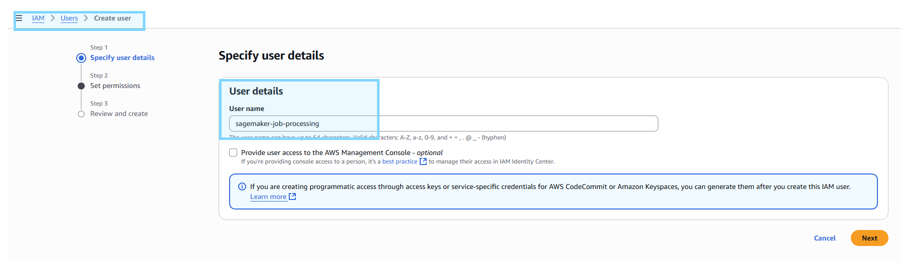
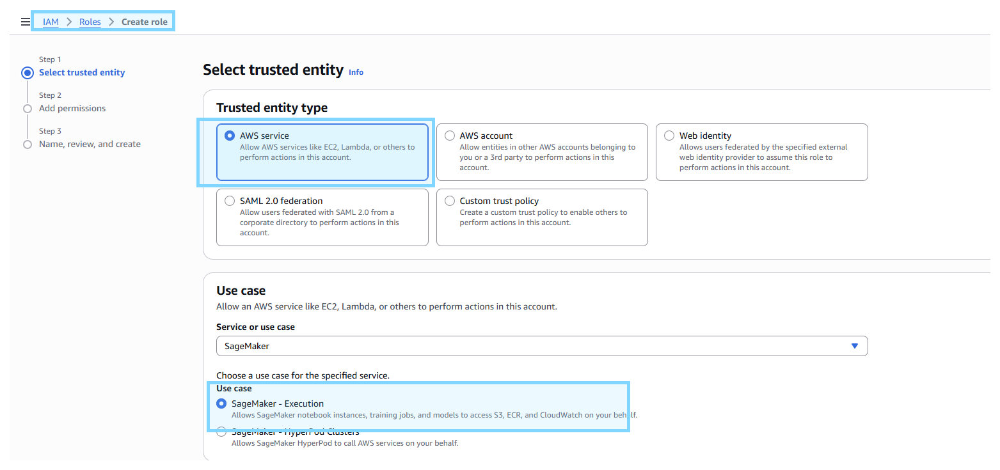
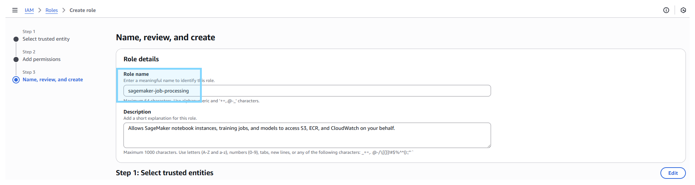
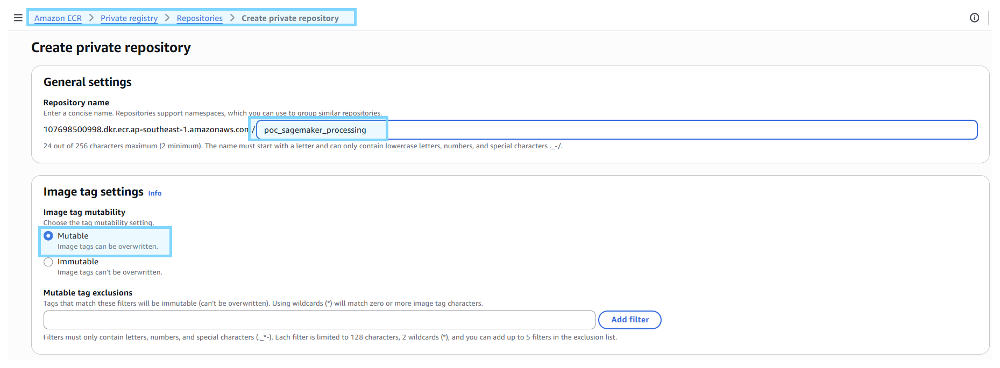

<<<<<<< HEAD
# Setup
-  **Copy `.env.example` to `.env` & fill up value**
```bash
AWS_ACCESS_KEY_ID= # AWS access key
AWS_SECRET_ACCESS_KEY= # AWS secret key
SAGEMAKER_ROLE= # AWS IAM role
```

# Create IAM User
- **Create IAM user**



- **Add IAM permission**
    - `AmazonSageMakerFullAccess`
    - `AmazonS3FullAccess`

# Create IAM Role

- **Create IAM role**




- **Add IAM permission**
    - `AmazonSageMakerFullAccess`
    - `AmazonS3FullAccess`

# Setup ECR
- **Create new ECR repositoy**



# Custom Docker Image
- **Create custom Dockerfile via `Dockerfile_sagemaker` file** 
=======
# sagemaker_processing_custom_image
Sagemaker Job Processing with Custom Image
>>>>>>> 430289fcec9833d9904e85f6632886092b277125
