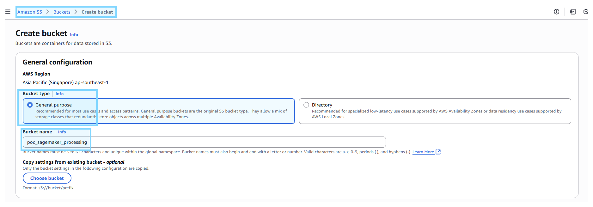

# Setup
-  **Copy `.env.example` to `.env` & fill up value**
```bash
AWS_ACCESS_KEY_ID= # AWS access key
AWS_SECRET_ACCESS_KEY= # AWS secret key
SAGEMAKER_ROLE= # AWS IAM role
```

# Create IAM User
- **Create IAM user**


- **Add IAM permission**
    - `AmazonSageMakerFullAccess`
    - `AmazonS3FullAccess`

# Create IAM Role

- **Create IAM role**


- **Add IAM permission**
    - `AmazonSageMakerFullAccess`
    - `AmazonS3FullAccess`

# Sagemaker Job Processing
- **Run script to send job to Sagemaker**
```shell
docker compose up -d
python sagemaker_job.py
```

- **Check processing job**


- **Check job log**
```bash
Arguments: Namespace(arg1='custom_value')
--- CUDA Status ---
Using device: cuda
Device Name: Tesla T4
Total GPU Memory Capacity: 14.74 GB
-------------------
Initial Memory Allocated: 0.00 GB
Initial Memory Reserved: 0.00 GB
--- Performing Allocation to GPU ---
Created a tensor of size: 25000000 elements.
--- Memory Check After Allocation ---
Memory Allocated: 0.09 GB
Memory Reserved: 0.09 GB
------------------------------------
Script finished successfully.

Processing job completed. Results in: s3://sagemaker-ap-southeast-1-107698500998/sagemaker-gpu-processing/output/
```




- **Check output files**
    - Self-customized in script `(output_data_uri = f"s3://{bucket}/sagemaker-gpu-processing/output/)`

