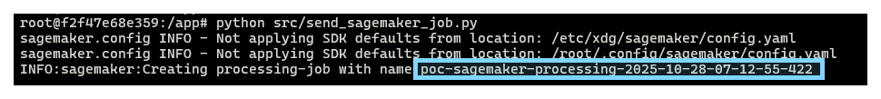
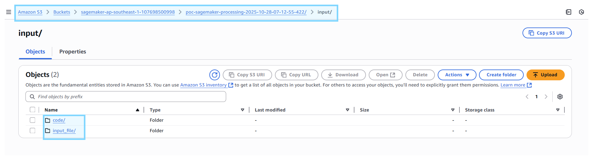

# Setup
-  **Copy `.env.example` to `.env` & fill up value**
```bash
AWS_ACCESS_KEY_ID= # AWS access key
AWS_SECRET_ACCESS_KEY= # AWS secret key
SAGEMAKER_ROLE= # AWS IAM role
AWS_ECR_ENDPOINT= # ECR endpoint
```

# Create IAM User
- **Create IAM user**


- **Add IAM permission**
    - `AmazonSageMakerFullAccess`
    - `AmazonS3FullAccess`

# Create IAM Role

- **Create IAM role**


- **Add IAM permission**
    - `AmazonSageMakerFullAccess`
    - `AmazonS3FullAccess`

# Setup ECR
- **Create new ECR repositoy**


# Custom Docker Image
- **Create custom Dockerfile via `Dockerfile_sagemaker` file** 
- **Build & push to ECR**
```shell
./cli/deploy_ecr.sh
```

# Run Sagemaker Job
- **Send processing job**
```bash
python src/send_sagemaker_job.py
```

- **Check job name**



- **Check job logs**
    - Search based on `job name`


- **Check job CODE & INPUT files**
    - Search based on `sagemaker-<AWS_REGION>-<AWS_ACCOUNT_ID>/<job_name>`



- **Check job OUTPUT files**
    - Search based on `sagemaker-<AWS_REGION>-<AWS_ACCOUNT_ID>/<job_name>`


